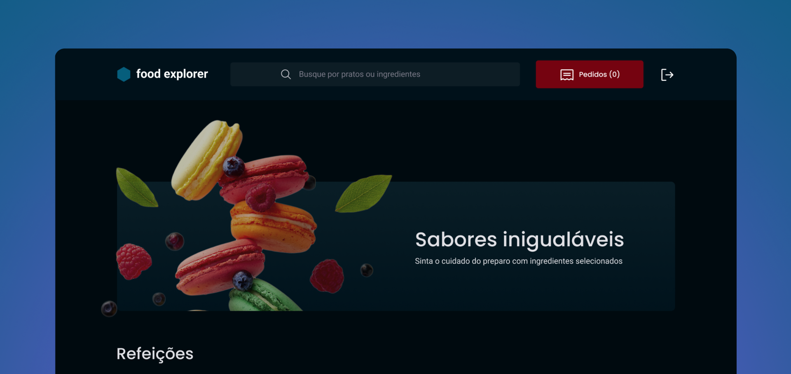

<h1 align="center">
     <br>
</h1>
<p align="center">
      
</p>
<p align="center">
  <a href="https://main--food-explorer-dlm.netlify.app/">
    
  </a>
</p>
> O Food Explorer é uma aplicação interativa e completa que simula a experiência de um restaurante fictício. Ele foi projetado para proporcionar uma jornada gastronômica única, permitindo que os usuários explorem pratos deliciosos, conheçam seus detalhes, ingredientes e sabores, e até mesmo efetuem pagamentos de maneira conveniente.

Este projeto foi o desafio final do curso Explorer da RocketSeat.

## 🚀 Executar a aplicação

Você precisará do Node.js instalado no seu computador para iniciar este aplicativo.

Backend:

```
git clone https://github.com/DionatanLM/FoodExplorer.git

# No Backend insira uma porta e um secret no arquivo .env vazio
  AUTH_SECRET=
  PORT=

# Navegue até o diretório
$ cd backend

# Instale as dependências necessárias
$ npm install

# Agora inicie o servidor
$ npm run dev
```

Frontend:

```
# Navegue até o diretório do Frontend
$ cd frontend

# Instale as dependências necessárias
$ npm install

# Agora inicie o servidor
$ npm run dev

# O terminal irá exibir o endereço local onde a aplicação está sendo executada.
```

## 🛠️ Tecnologias

- FrontEnd: ReactJS, Javascript, Vite, Styled Components, React Router Dom e Axios
- BackEnd: NodeJS, Multer, BCryptjs e Express
- Banco de Dados: SQlite e Knex.js como Query Builder
- Deploy: Render e Netlify
  > Link do prejeto no ar: https://main--food-explorer-dlm.netlify.app/

## 🔑 Quer ver como a aplicação funciona vista pelo Admin? Use a conta a seguir:

```
  e-mail: admin@foodexplorer.com
  senha: 123456
```

- FrontEnd: ReactJS, Javascript, Vite, Styled Components, React Router Dom e Axios
- BackEnd: NodeJS, Multer, BCryptjs e Express
- Banco de Dados: SQlite e Knex.js como Query Builder
